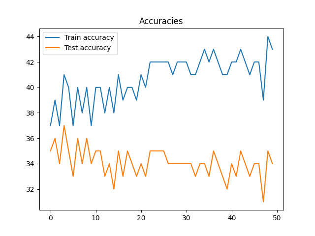
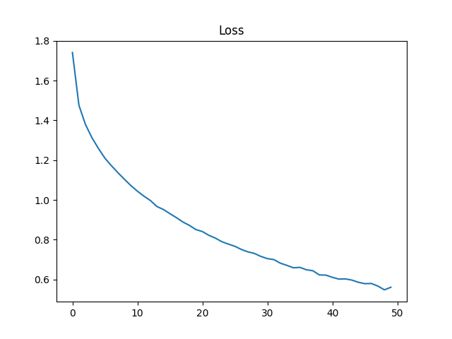
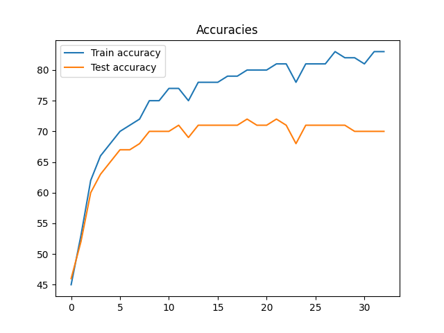
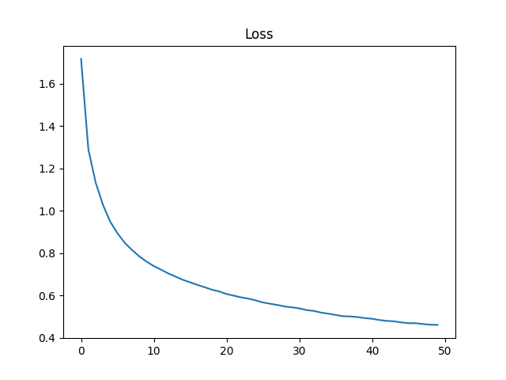

# LazyNet
Fully connected one layer accuracy never goes above 40%:

This network seems to have too little plasticity to learn correctly.

# BoringNet
## non RELU
Without a non linear activation it seems that it can't correctly approximate at all.

## RELU
It looks like the network rapidly reaches ~50% accuracy in testing and then starts overfitting:

The corresponding loss graph shows that, although the test accuracy doesn't increase, the (over) fitting to train data does:

The RELU activation should allow the network to start being able to aproximate the function as described by the Universal Approximation Theorem.
But the amount of plasticity seems to still be too low.

# CoolNet

Using the layers proposed by [Karpathy](https://cs.stanford.edu/people/karpathy/convnetjs/demo/cifar10.html):
* Conv 5x5
* Max pool 2x2 stride 2
* Conv 5x5
* Max pool 2x2 stride 2
* Conv 5x5
* Max pool 2x2 stride 2
* linear 4*4*20x10 (RELU)

This seems plastic enough to learn to classify better than LazyNet and BoringNet.
But it does take around 4hs to train 200 epochs on Google Colab on CPU.

## 50 epochs default hiperparams

Training seemed to be overfitting, although the test accuracy is much better than before at 70%.

## Learning rates

### 50 epochs learning rate 10

This broke completely, the network went to nan values very fast.

### 50 epochs learning rate 0.1

Test accuracy goes down when compared to the default lr of 0.01. 
This might be because of 'skipping' over a region of lower loss, as the loss gets stuck around 1.2:

Compared to default run with lr 0.01:

### 50 epochs learning rate 0.01

This is the default, see "50 epochs default hiperparams"

### 50 epochs learning rate 0.0001

Very steady progress, although very slow:

It never even reaches 70% test accuracy.

### 0.01 seems best

The learning rate 0.01 seems to reach the 70% test accuracy mark fast enough, while not skipping over big areas of low loss:

Loss reaches ~0.6 which seems ok.

## Reducing learning rate

Starting at 0.01 and slowly reducing every 50 epochs seems like a sensible idea, but it seems to worsen the test accuracy:

This might indicate that the network plasticity has reached its limit; that all the weights are stuck in a local minima; or that the training data is too small.

The third seems to be more accurate, see "Augmentation" lower down.

