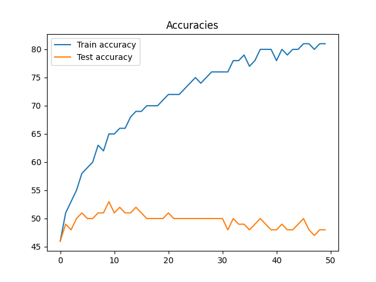
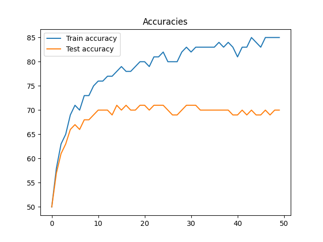

# LazyNet
Fully connected one layer accuracy never goes above 40%:

This network seems to have too little plasticity to learn correctly.

# BoringNet
## non RELU
Without a non linear activation it seems that it can't correctly approximate at all.

## RELU
It looks like the network rapidly reaches ~50% accuracy in testing and then starts overfitting:

The corresponding loss graph shows that, although the test accuracy doesn't increase, the (over) fitting to train data does:

The RELU activation should allow the network to start being able to aproximate the function as described by the Universal Approximation Theorem.
But the amount of plasticity seems to still be too low.

# CoolNet

Using the layers proposed by [Karpathy](https://cs.stanford.edu/people/karpathy/convnetjs/demo/cifar10.html):
* Conv 5x5
* Max pool 2x2 stride 2
* Conv 5x5
* Max pool 2x2 stride 2
* Conv 5x5
* Max pool 2x2 stride 2
* linear 4*4*20x10 (RELU)

This seems plastic enough to learn to classify better than LazyNet and BoringNet.
But it does take around 4hs to train 200 epochs on Google Colab on CPU.

## 50 Epochs default hiperparams

Training halted after 30 epochs as it seemed to be overfitting, although the test accuracy is much better than before at 70%.